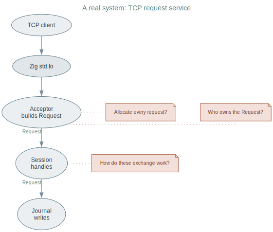
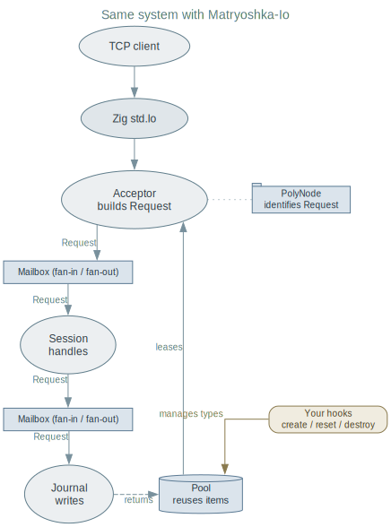

# The Shape of a Real System

A real system is more than an event loop.

* Objects get built in one place. Used in another.
* Someone owns each object.
* Someone frees it.
* Someone decides: reuse it, or make a new one.
* An event loop tells you when a socket is ready.
* It does not tell you who owns the request you just built.

A small but real system: a TCP request service.

Three pains. You have hit all three before.

* **Pain 1 — ownership.**
    * Acceptor builds a Request.
    * Session handles it.
    * Journal writes it.
    * Nothing says who frees it, or when.

* **Pain 2 — allocation.**
    * Acceptor allocates a buffer per request.
    * Uses it once.
    * Throws it away.

* **Pain 3 — coupling.**
    * Session and Journal must pass work to each other.
    * No shared type.
    * So: an interface, or a virtual table.

Not exotic. Shows up the moment a system outgrows one function.

Same system. Same boxes. Three small blocks added.

The three pains now have names.

* [**PolyNode**](building-blocks/polynode.md) identifies the Request.
  No interface. No virtual dispatch.

* [**Mailbox**](building-blocks/mailbox.md) moves the Request across
  roles. Ownership travels with it.

* [**Pool**](building-blocks/pool.md) leases the Request. Takes it
  back. Reuse, not allocate-and-discard.

* The `std.Io` box has not moved.
* It still does readiness, wait, cancel.
* Matryoshka uses it. Matryoshka does not replace it.

This page: three pains, three blocks. Not how each one works.

For that: read [Building Blocks](building-blocks/index.md) in detail.
